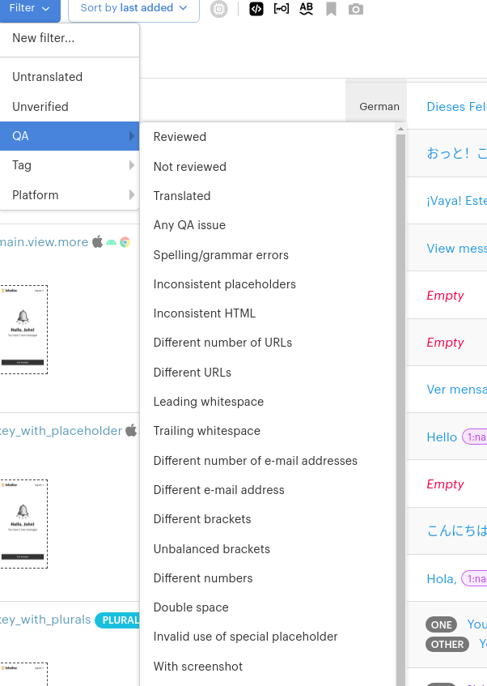

## App Featutures
  - User Favorite or most used language 
  - Google, Microsoft, Amazon MT
    
  - Different Workspace for localization 
    
  - Copy-Paste Data 
  - Important File Formats //
    - strings, plist, xliff, xml, properties, po, php, ini, json
      yml, xls, resx, srt, arb 
  - All Keys to Single file | Use previously assigned filenames
  - Nav Header Bar
    
  - Featured Apps:
    - Github, Github Enterprise
    - Bitbucket, Bitbucket Enterprise
    - Amazon s3, Adobe XD
    - Gitlab, Zendesk, Slack  
  - One Sample Project with Some data to user understand the software to use
  - All Projects Summary in one single window 
      
  - email notification 
  - url generate to user open any specific page from 3rd party site like url sending in slack
  - Users data backup periodically
  - Periodic events implementation where applicable
  - Screenshots and its reference keys 
  - Notifications for every user while login(Notification separate model) 
  - Admin view on behalf of a user 
  - django object level permissions to be added  
  - obsolete database records finding and removing by periodic signals
  
## Usual issues
  - Migration version issues while git pushing other developer commits 
  
## Model and its fields Plannings
  - Singular and plural for segments
  - Tagging and filtering by tag based on editor(Workspace)
  - Segment Status (Platform, QA, unverified, etc...)
    
  - QA Dropdown
    
  - Translation History
    
  - Glossary manage  
    
  - Projects Summary Model
  - Word Count and Segment(key) count in a Project
  - Translators name info on specific content translate
  - Bilingual and Multilingual 
  - Translation and Review fields
  - Email Notification models 
    
  - Create Task 
    
  - Apply specific filters and assign as tasks 
  - Vendors and Usergroups 

## Additional Features to be included
  - Caches the api data where applicable 
  - Stripe payment integeration
  - Possible causes to a specific error
  - logging 
  - variables tracking using decorator or any other simple methods 
    to get variable value very easy 
   
    
## App Important features to include:
  - api only testing 
  - debugging the request
  - request data store where request raises errors 
  - logging 
  - monitoring 
  - mail or slack notification to develiopers
  - Different app api responses for 
        admin, software engineers, client, project managers.
        Developing the software in mind above case.
  - Middlewares for easy error handing
  - Runtime variables storing in mongodb for debugging quick
  - api load testing environment
  - Dashboard
  - Vendors model 
  - User groups model 
        
## App Future cloud deployment and Integerations:
  - Digital ocean 
  - AWS Cloud
  - Google platform 
    
## Sources:
  - test and test output data files managing
    
## Softwares to be used or tried:
  - docker
  - docker-compose
  - Makefile
  - terraform if required
  - django actions 
  - kubernetes 
  - jenkins 
  - github projects utilize for api bug, issues, new feature development
    
## Reference Links
  - [lokalize site](https://lokalise.com)
  - [lokalize for developers](https://lokalise.com/product/for-developers)
  - [supported apps by lokalize](https://app.lokalise.com/apps/)
  - [Github Automation](https://youtu.be/G8hMe9NHfhY)
  - [Lokalise Github Integeration](https://youtu.be/AKaE_2Q4yBY)

## Discussion To be Requiered
  - Enable cleanup mode

## COMMANDS
  - hookdeck listen 8000 github 
  
Useful Links:
  - [dj rest github integeration](https://django-rest-auth.readthedocs.io/en/latest/installation.html)